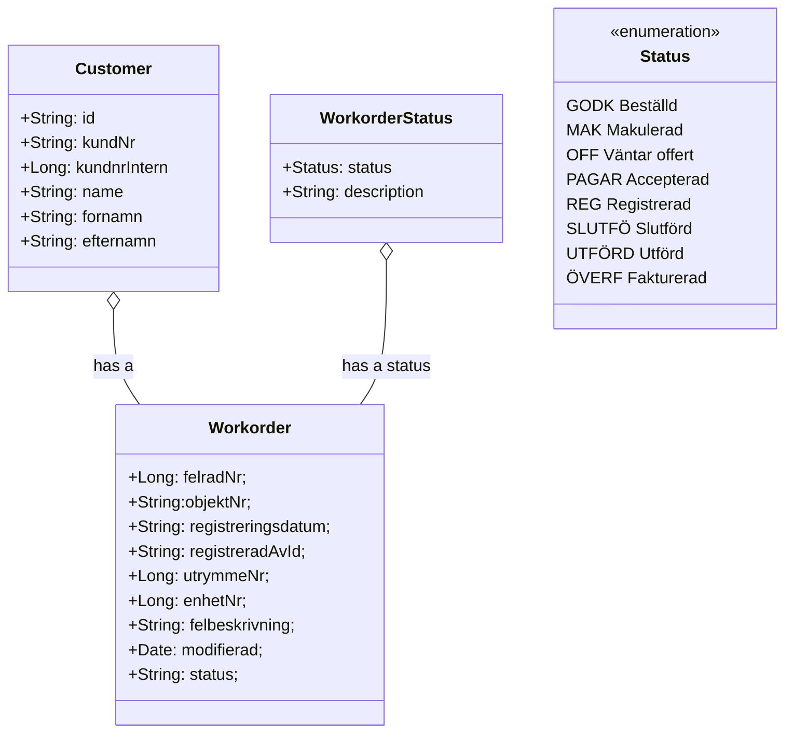

# cadec-2022-skaffold

Cadec 2022 Skaffold presentation

### Updating the image used by a deployment

- [ ] deployement must be using the latest tag
- [ ] make a change in your code
- [ ] build the image `docker build -t maitriyogin/event-bus . `
- [ ] push the image to docker hub
- [ ] run the command
      `k rollout restart deployment posts-depl`

### Types of services

1. Cluster IP - only exposes pods to other pods in the cluster
2. Node Port - For dev usage, expose a port to the outside world
3. Load Balancer - For external usage, expose a port to the outside world
4. External Name

All these services are objects

## CURL

curl -d '{"id":"1", "title":"my first post"}' -H "Content-Type: application/json" -X POST http://localhost:30423/posts/create
curl -d '{"id":"1", "title":"my first post"}' -H "Content-Type: application/json" -X POST http://posts.com/posts/create
curl GET http://localhost:30423/posts

## K8 commands

k get pods
k exec -it [podname][cmd] - execute the command in a running pod
k logs [podname]
k delete pod [podname]
k apply -f [config file name, posts.yml] - recreate the pod
k describe pod [podname]
k rollout restart deployment event-bus-depl - replaces the pod with a new one, run k describe pods before hand
kubectl exec -it query-depl-5597b7b868-vdxj7  -- /bin/sh // shell into pod

### project id

ticketing-dev-342416

### Host change

127.0.0.1 kubernetes.docker.internal

# End of section

### Hosts 
``vim /etc/hosts``
127.0.0.1 local.fast2.com

### Relationships

