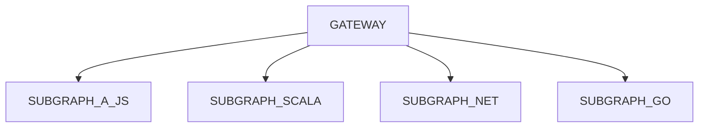
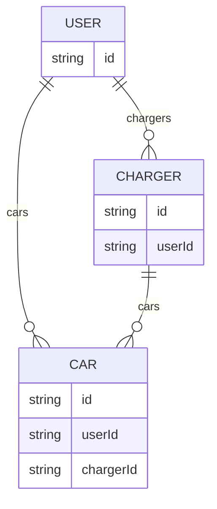
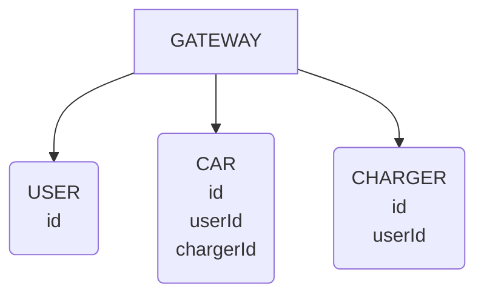
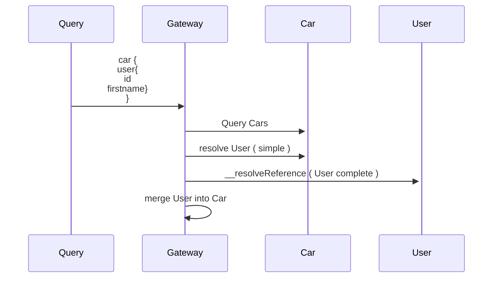
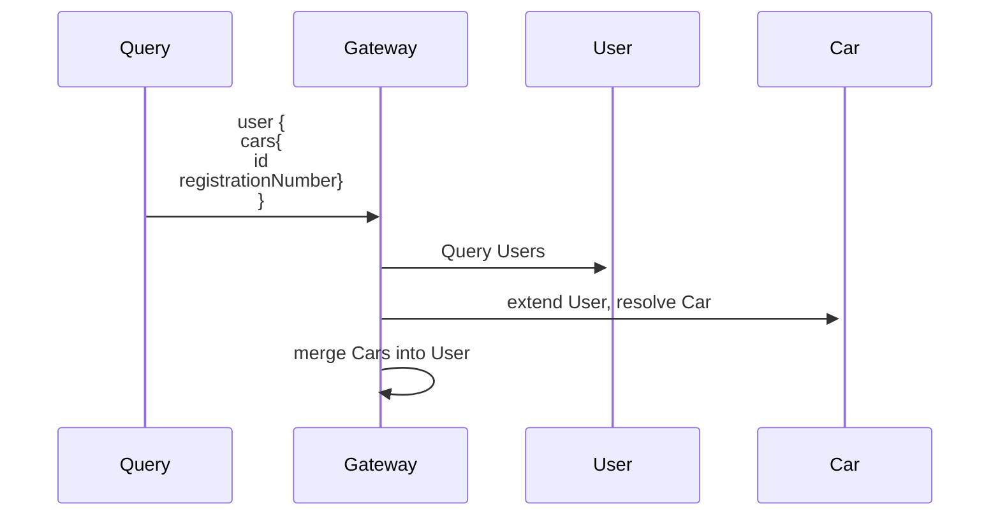

# Graphql Federations - React Meetup

### Date = 20220331

### Relationships

## Apollo Federation

### Scale your graph across teams

1. lets you build and operate services independently, while contributing to the overall graph
2. lets your service implement just the part of the graph it's responsible for
3. routes queries across services
4. Use any language in your subgraphs



### Tooling

1. Create subgraph, by including your schema and resolver in the ApolloServer creation

```ts
const { ApolloServer } = require('apollo-server');
const { buildSubgraphSchema } = require('@apollo/subgraph')
const { typeDefs } = require('./schema')
const { resolvers } = require('./resolvers')
// The ApolloServer constructor requires two parameters: your schema
// definition and your set of resolvers.
export const server = new ApolloServer({ schema: buildSubgraphSchema({ typeDefs, resolvers }) });

```

2. Create the Gateway / super graph

```ts
import { ApolloServer } from "apollo-server";
import { ApolloGateway } from "@apollo/gateway";
import { readFileSync } from "fs";

const supergraphSdl = readFileSync("./supergraph.graphql").toString();
const gateway = new ApolloGateway({
  supergraphSdl,
});
export const server = new ApolloServer({
  gateway,
});
```

The ApolloGateway needs the `supergraph.graphql` which is generated from the `supergraph.yml`

3. Supergraph.yml

```yaml
subgraphs:
  user:
    routing_url: http://user-srv:4002
    schema:
      subgraph_url:
        http://localhost:30110
  car:
    routing_url: http://car-srv:4001
    schema:
      subgraph_url:
        http://localhost:30111
  charger:
    routing_url: http://charger-srv:4000
    schema:
      subgraph_url:
        http://localhost:30112
```

1. subgraph_url - is either a file path or url to a sub graph schema. In our case here we're going into the node port
   services exposed from the cluster
2. routing_url - are the subgraphs urls, the supergraph will query these while serving queries.
1. in our case these are clusterIp services and are referenced via the cluster name and ports.
2. you can see these names by running `kubectl get services`
3.

```
projects/maitriyogin/gql-fedarations on main [+!] via ⬢ v16.13.1 via 💎  3.1.0
➔ k get services
NAME                    TYPE        CLUSTER-IP       EXTERNAL-IP   PORT(S)           AGE
car-mongo-srv           ClusterIP   10.110.175.195   <none>        27017/TCP         124m
car-node-srv            NodePort    10.96.229.128    <none>        4001:30111/TCP    124m
car-srv                 ClusterIP   10.100.107.206   <none>        4001/TCP          124m
caris-client-node-srv   NodePort    10.97.198.54     <none>        3000:30001/TCP    124m
cars-client-srv         ClusterIP   10.102.86.243    <none>        3000/TCP          124m
charger-mongo-srv       ClusterIP   10.106.233.214   <none>        27017/TCP         124m
charger-node-srv        NodePort    10.108.31.222    <none>        4000:30112/TCP    124m
charger-srv             ClusterIP   10.101.175.250   <none>        4000/TCP          124m
esl-query-node-srv      NodePort    10.102.10.204    <none>        4003:30115/TCP    124m
esl-query-srv           ClusterIP   10.97.59.82      <none>        4003/TCP          124m
kubernetes              ClusterIP   10.96.0.1        <none>        443/TCP           31d
user-mongo-node-srv     NodePort    10.108.230.160   <none>        27017:30310/TCP   124m
user-mongo-srv          ClusterIP   10.101.83.30     <none>        27017/TCP         124m
user-node-srv           NodePort    10.103.177.178   <none>        4002:30110/TCP    124m
user-srv                ClusterIP   10.97.189.60     <none>        4002/TCP          124m
```

### Connecting the Graphs

1. Take a domain model or document

```js
  user: {
  id,
    firstName,
    lastName,
    cars
:
  [
    { id: 1, registrationNumber: "ABC1234" },
    { id: 2, registrationNumber: "ACDC666" },
  ],
    chargers
:
  [
    { id: 1, serialNumber: "ABC1234" },
    { id: 2, serialNumber: "ACDC666" },
  ],
}
,
```

2. ### Define those entities - think RDS but with services



5. Define our subgraphs



6. ### 1 relationships - User
7. Specify PK's with @key directive
8. Add a reference resolver for that type

```ts
  User: {
  __resolveReference: async (reference: IUser) => {
    console.log("####### Resolve User", reference);
    return await User.findOne({ id: reference.id });
  }
}
```

9. ### From the many side, Define your extensions from the many side, so with CAR
10. Schema - Extend the User type in the Car schema, with cars
11. this is known as a stub and contains enough info to identify the User
1. `extend` - indicate that User is an entity thats defined in another subgraph
2. `@key` - directive indicates that User uses the id field as it's primary key. 1. this must match exactly on @key
   defined in the entity's originating subgraph, even if there are multiple
3. `external` - is the external @key of the User entity.
4. `cars` - will resolve to the Cars in the Car subgraph which is where we are.

```graphql
extend type User @key(fields: "id") {
    id: ID! @external
    cars: [Car]
}
```

15. #### Benefits
16. Syntax allows you to run the subgraph in isolation
17. provides strong typing
18. ### Resolvers
19. Because Car now extends User we need create a user resolver function in the Car resolver
1. which basically gives us enough to identify that entity 1. After you define an entity in one subgraph other subgraphs
   can reference that entity in their scheme by extending it.

```ts
  Car: {
  user: (car: ICar) =>
    ({
      __typename: "User",
      id: car.userId,
    })
}
```

20. A representation of the User is returned which only contains it's id and __typename, just enough for it's identity
21. If we then had a query where Car wanted to get it's users firstname ...

```graphql
query C {
    cars{
        registrationNumber
        user {
            id
            firstName
        }
    }
}
```

22. A second query would occur to try and resolve the User from the User subgraph.
23. This is achieved with the ```__resolveReference``` function in the User's resolver

```ts
  User: {
  __resolveReference: async (reference: IUser) => {
    console.log("####### Resolve User", reference);
    return await User.findOne({ id: reference.id });
  }
}
```

24. It provides the gateway with direct access to a particular entity's fields, without need to use a custom query to
    reach that entity.
25. After fetching the User.firstName via the reference resolver the gateway can intelligently merge the data it
    obtained

### Fetch Cars and their Users



### Fetch User and it's Car



26. ### Adding Cars to the User
27. Schema - We extend the User type with cars

```graphql
extend type User @key(fields: "id") {
    id: ID! @external
    cars: [Car]
}
```

28. So whenever a subgraph extends an entity with a new field, it's responsible for resolving that field
1. Gateway first fetches User.id from the User subgraph
2. Gateway then passes those User.id values to the Cars subgraph


